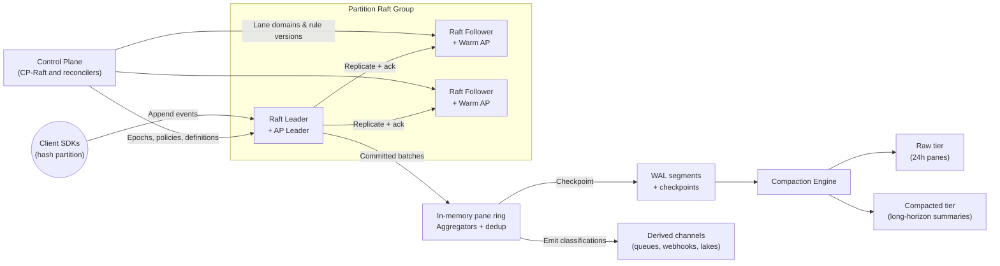
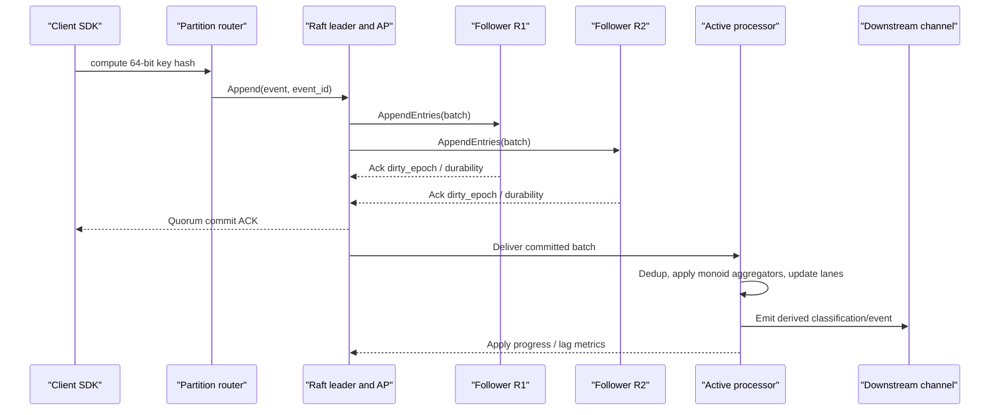
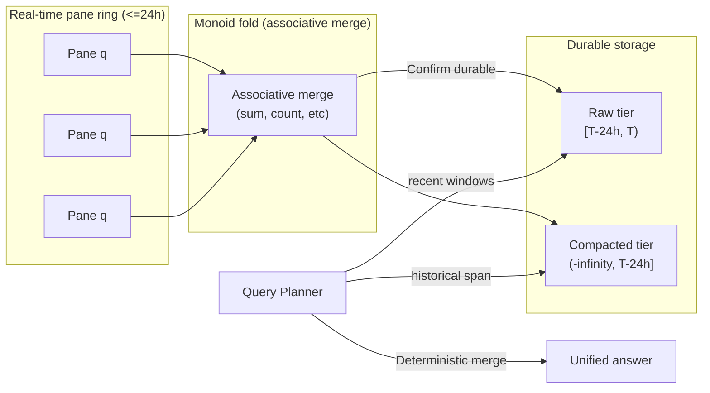

# CEPtra

CEPtra is a unified complex event processing engine that marries real-time alerting with long-horizon analytics in a single Rust binary. It ingests heterogeneous telemetry, keeps deterministic state in-memory, and serves both sub-second reactions and replay-grade insight without stitching together separate systems.

## Why Teams Choose CEPtra
- **Deterministic real-time decisions:** Every partition is backed by a three-voter Raft group, guaranteeing consistent ordering, idempotent replays, and p99 end-to-end latency under five milliseconds for accepted events.
- **Streaming + historical in one place:** Raw panes and compacted summaries live in the same storage hierarchy, allowing queries to span the last seconds through months of history with identical results.
- **Hot-reloadable rules:** PromQL-style bundles and CEL logic are versioned, validated for bounded cardinality, and activated atomically via control-plane epochs—no downtime or drift between replicas.
- **Operational guardrails baked in:** Credit-based flow control, durability fences, and telemetry-first observability keep throughput predictable even when storage slows or followers lag.
- **Easy to run anywhere Kubernetes lives:** A single auto-arranging StatefulSet handles the control plane, Raft replicas, and active processors while maintaining quorum-backed durability on NVMe-backed volumes.

## Platform Architecture

Each pod in the StatefulSet can assume both control-plane and data-path responsibilities. The control plane drives definition lifecycles, placement, and durability policy. Within every partition, the Raft leader also hosts the active processor responsible for deduplication, pane maintenance, and rule evaluation; followers trail the log and keep warm replicas that can assume leadership without replay drift.

## Event Journey

Client SDKs respect a server-advertised credit window, shrinking on backpressure and expanding when replicas are healthy. Leaders only acknowledge once a quorum confirms the batch is safely resident under the selected durability mode (`Strict` or `Group-fsync`). The active processor consumes committed entries, maintains rolling windows, and emits derived events with deterministic IDs so downstream systems can deduplicate replays.

## Data Lifecycle and Compaction

Raw panes cover the most recent horizon (for example, 24 hours) to support granular replays and fine-grained windows. Once a pane ages past the cutover point, the compaction engine folds it into a long-term aggregate using the same associative monoids that power real-time computation. Queries that span the boundary fetch recent panes from the raw tier and older slices from the compacted tier; because both sides rely on deterministic merges, the combined result is identical to processing the full raw stream.

## Operational Guarantees at a Glance
- Linearizable writes within each partition, with deterministic replays that reproduce identical pane state and derived outputs.
- Quorum-backed durability with a configurable loss bound—`Strict` for synchronous fsync and `Group-fsync` for bounded async durability.
- Sub-second recovery via checkpoints that persist pane buffers, dedup tables, and per-key sequence maps.
- Observability hooks for Raft health, credit hints, lane usage, durability fences, and rule activations to keep operations transparent.
- Secure by default: mTLS on every RPC, signed definition bundles, and encrypted persistent volumes.

## Typical Use Cases
- IoT fleets that need instant anomaly detection plus months of replayable telemetry.
- Security operations centers correlating IDS, EDR, and identity trails into reliable incidents.
- Telco and edge networks maintaining rolling QoS baselines while archiving historical performance.
- High-scale commerce and gaming workloads blending second-by-second metrics with longer baselines for fraud or fairness detection.

CEPtra lets teams replace brittle chains of streaming jobs and warehouses with a single, deterministic engine that is tailored for both rapid decisions and auditable history.
