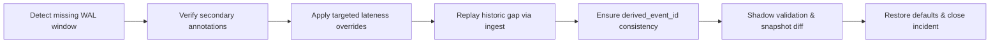
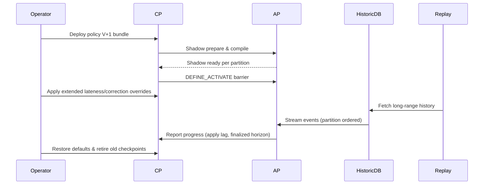

# CEPtra Backfill Operations

This guide captures the end-to-end processes required to rebuild state from a reliable historic event source while the cluster keeps serving live traffic. It is written for operators and automation authors and covers three recovery scenarios:

1. Full recovery when Raft logs are empty.
2. Partial recovery after missing events during an outage.
3. Policy deployments that demand extended historical backfill.

The procedures rely exclusively on behaviors guaranteed in the system specification (notably §§10, 11, 13, 15, 17–20, 23, 24) and do not require architectural changes.

---

## Shared Foundations

### Prerequisites
- **Historical source:** Durable database capable of streaming events ordered by `part_id`, `raft_log_index` surrogate, or `(event_time, event_id)` with deterministic tiebreakers.
- **Runbook integration:** CP APIs `/v1/definitions`, `/v1/config`, `/v1/activate`, `/v1/replay`. Automation must authenticate with `operator` or higher credentials per §22.
- **Monoid contract:** All aggregations involved in backfill obey `Invariant A*`; external tooling must not apply non-associative transforms.
- **Metadata fidelity:** External systems that annotate decisions during downtime must use existing event fields (`flags`, headers, payload attributes) so replays remain deterministic (§11.2).

### Control Knobs
- `lateness_allowance_L` and correction horizon `C` per metric (§13.3) to widen mutable panes during backfill.
- Dedup retention settings (`dedup_capacity_per_partition`, §3) sized to hold combined realtime and replay inflight events.
- Flow-control thresholds (`apply_lag_seconds`, `replication_lag_seconds`, §17) used to throttle historical ingestion.
- Checkpoint cadence + retention (`checkpoint_full_interval`, `checkpoint_retained_fulls`, §20) ensuring replay anchors exist for every partition.

### Observability Checklist
- `definition_warmup_pending{part_id}`, `apply_lag_seconds`, `compaction_duration_seconds`, `finalized_horizon_stall{part_id}`.
- Audit log entries for overrides (`/v1/config`), activations, and replay jobs (§24.6, §22.6).
- Historic ingestion metrics surfaced by automation: events streamed, lag to historic target, retry counts.

---

## Scenario 1 – Full Recovery (Empty Raft Logs)

Applies when a partition loses all WAL segments (e.g., fresh cluster restore) but raw historic data is intact elsewhere.

### Objectives
- Rehydrate checkpoints, panes, and compacted tiers entirely from the external history.
- Allow realtime clients to resume as soon as readiness thresholds permit, even while historic ingestion continues.

### Process
1. **Bootstrap Cluster**
   - Start StatefulSet; CP forms quorum (§26). Partitions load baseline checkpoints; missing WAL tails leave `apply_index == checkpoint_index`.
   - Set `/v1/config` overrides: widen `lateness_allowance_L` and `correction horizon C` for affected metrics; optionally raise `dedup_capacity_per_partition`.
2. **Gate Ingress**
   - Advertise `TRANSIENT_WARMUP` to clients until each partition reports `ready=false` with reason `warmup`. Real-time events may still arrive; they are applied immediately after the historic stream catches up to their sequence indices.
3. **Initiate Historic Replay**
   - Automation queries the historic DB for each partition and streams events through the standard ingest API flagged as `REPLAY=true` (if implemented) so they bypass client dedup tracking but still enter Raft.
   - Respect strict ordering per partition; batch sizes tuned to keep `apply_lag_seconds ≤ 0.2`.
4. **Concurrent Real-time Handling**
   - As live events arrive, they interleave with historic entries. Raft ordering ensures deterministic state. Historic loader monitors commit index; when live traffic jumps ahead, continue replay until log index reaches the live head.
5. **Compaction & Finalization**
   - Compaction jobs fold panes as they become available. Because both raw and historic panes use monoid `⊕`, rebuilt compacted tiers match real-time semantics.
6. **Exit Criteria**
   - Historic cursor reaches desired horizon (typically `now - R_raw` for raw tier plus compacted history).
   - Restore default lateness/correction overrides.
   - `/readyz` reflects each partition ready with no warmup reasons.

### Timeline
```mermaid
sequenceDiagram
    participant Operator
    participant CP
    participant AP
    participant HistoricDB
    participant Clients

    Operator->>CP: Scale cluster / form quorum
    AP-->>CP: Report warmup (empty WAL)
    Operator->>CP: Apply lateness/dedup overrides
    Operator->>HistoricDB: Fetch partition cursor
    HistoricDB->>AP: Stream historic events via ingest
    AP-->>Clients: Continue acking live events in order
    AP->>CP: Update apply_lag / readiness
    Operator->>CP: Restore defaults once historic replay complete
    CP-->>Clients: Ready=true; normal flow resumes
```

---

## Scenario 2 – Partial Recovery After Outage

During a serious outage, some events were never ingested. A secondary system processed a simplified rule set; its decisions are reflected in event payloads when history is replayed.

### Objectives
- Reconcile missing WAL range while preserving deterministic outputs, honoring classifications recorded by the secondary system.
- Ensure that reprocessed events do not trigger duplicate downstream actions (thanks to consistent `derived_event_id` semantics §11).

### Process
1. **Assessment**
   - Identify affected partitions and the `[missing_start, missing_end]` window via CP telemetry (e.g., `partition_lag`, `audit`).
   - Validate that the secondary system annotates each event with metadata consumable by CEPtra (e.g., payload attribute `secondary_classification`, header flag `DERIVED`, or rule-specific markers).
2. **Warmup & Shadow**
   - If definitions changed during outage, ensure current `def_version` shadow-prepares (§15) before replay. Otherwise, continue with existing version.
   - Apply temporary overrides to lateness/correction only for impacted metrics to keep other workloads unaffected.
3. **Replay Gap**
   - Request historic events covering the missing interval. Replay in Raft order, injecting them between existing indices. Because WAL already contains prior and subsequent entries, the replay tool must honor the original Raft index gaps (in practice by feeding them through ingest; Raft will assign new contiguous indices but with event timestamps inside the gap).
   - For each event, persist secondary decisions in stateful aggregators (e.g., treat classification fields as inputs to meta-aggregation rules or store them in audit logs).
4. **Deterministic Downstream Behavior**
   - Rules recompute derived events with the same `derived_event_id` because they hash `(part_id, raft_log_index, rule_version, rule_id, channel)`. Ensure any new derived events due to secondary decisions use identical rule IDs or include `external_decision_id` so sinks deduplicate.
5. **Validation**
   - Compare sample aggregates or rule outputs between a shadow partition and production results to confirm replay alignment. Automation can invoke `TEST/ExportMetricsSnapshot`.
6. **Cleanup**
   - Roll back overrides, ensure compaction caught up, and clear any temporary audit suppression.

### Flow


---

## Scenario 3 – Policy Deployment Requiring Extended Backfill

A new `policy_version` depends on additional attributes and longer historical windows (e.g., expanding daily compaction to six months). This scenario extends the hot-reload model with orchestrated replay.

### Objectives
- Introduce the new policy while maintaining live service.
- Backfill extended history post-activation without breaking latency SLOs.

### Process
1. **Preflight**
   - Validate aggregator definitions expose `upgrade(from,to)` where possible; flag metrics needing replay (§18.8).
   - Ensure historic DB can provide the extra attributes; coordinate schema migrations if necessary (§18.2).
   - Adjust storage quotas and compaction jobs for longer retention.
2. **Bundle Distribution**
   - Upload new definition bundle; partitions enter shadow mode while still emitting with old version (§15).
   - For metrics lacking upgrade paths, automation triggers partition-level WAL replay from the latest full checkpoint before activation to pre-populate state.
3. **Activation**
   - Once `definition_warmup_pending` clears for targeted partitions, CP appends the activation barrier. All new log entries process under the new policy.
4. **Extended Historical Replay**
   - Immediately raise lateness and correction horizons for the affected metrics to cover the longer look-back window (e.g., 6 months).
   - Launch replay workers that stream archived events from beyond the former retention. Sequence them partition-by-partition, respecting apply-lag guardrails. Automation should stage per-partition control loops (refer to `docs/publication_recovery.md` for finer detail).
5. **Compaction Alignment**
   - Monitor nightly compaction; newly reconstructed panes must reach the 6-month compacted tier. Use `compaction_duration_seconds` and `finalized_horizon_ts_ns` to ensure tiers converge.
6. **Normalization**
   - After replay reaches the target historic horizon, revert overrides, prune obsolete checkpoints and definitions, and confirm readiness.

### Sequence


---

## Automation Requirements
- **Replay Orchestrator**
  - Fetch partition manifests (partitions, epochs, last applied index) via `/v1/state`.
  - For each partition, maintain idempotent cursor state so restarts resume replay without duplication.
  - Integrate lag feedback: pause or rate-limit when `apply_lag_seconds` or `replication_lag_seconds` exceed thresholds.
  - Surface metrics (`replay_events_total`, `replay_bytes_total`, `replay_partition_lag_seconds`) for observability.
- **Config Manager**
  - Atomically stage overrides with explicit validity windows and automatic rollback.
  - Validate that overrides do not violate `LANE_MAX_PER_PARTITION`.
- **Audit Hooks**
  - Record every replay batch, override change, and activation in audit logs with operator identity and timestamps.

---

## Verification & Completion Checklist
- [ ] Historic cursor reached target horizon for all partitions.
- [ ] Overrides reverted; configuration matches baseline.
- [ ] `/readyz` reports `ready=true` cluster-wide; no partitions stuck in `warmup` or `definition_warmup_pending`.
- [ ] `apply_lag_seconds` and `replication_lag_seconds` within normal SLO.
- [ ] Compacted tiers contain backfilled ranges; `finalized_horizon_ts_ns` matches expectations.
- [ ] Audit log entries reviewed and archived with incident/change record.

Following these procedures ensures CEPtra can recover deterministic state across full rebuilds, partial outages, and definition upgrades while keeping real-time ingestion online. Minimal automation additions (replay orchestration, config management, audit integration) are sufficient; no specification changes are required.
