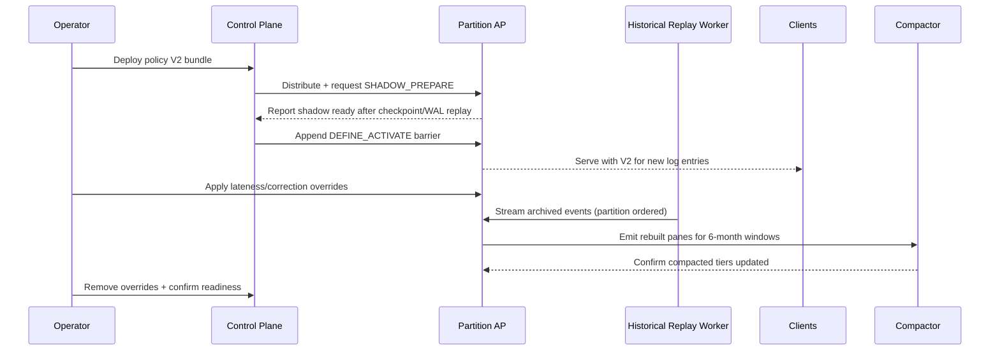
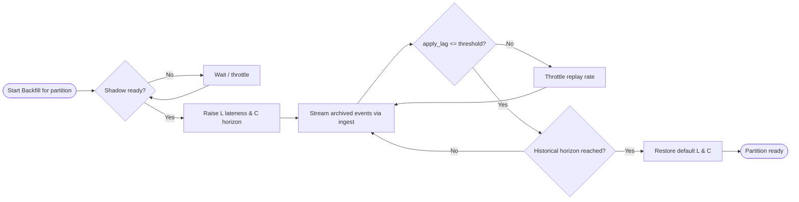

# Historical Reload During Policy Deployment

## Scenario Recap
- Live cluster runs `policy_version = 1` with daily panes compacted nightly and a 3‑month compacted retention.
- Upcoming `policy_version = 2` keeps some aggregations identical, modifies others, introduces new series, and carries new 6‑month horizons.
- All historical raw events exist in an external store and must be replayed so compacted state reflects the new definitions without halting real‑time ingestion.

## Key Mechanics From Specification
- **Hot reload (§15):** Control Plane (CP) distributes bundles, partitions shadow‐apply until WAL catch‑up, then activate via a `DEFINE_ACTIVATE` barrier.
- **Policy upgrades (§18.8):** If an aggregator cannot `upgrade(from,to)` directly, the AP replays from the latest retained full checkpoint; missing history must be supplied before readiness clears.
- **Compaction (§10):** Raw panes fold into compacted tiers through associative monoids; reconstructed panes can merge with existing tiers without skew.
- **Watermarks & lateness (§13):** Adjustable `lateness_allowance_L` and correction horizon `C` determine how far back panes stay mutable; overrides can be applied per metric during maintenance.
- **Durability & replay (§11, §19–20):** WAL + checkpoints guarantee deterministic state rebuild, so historical replays interleave safely with new events as long as ordering and epochs are preserved.

## Recovery Flow With Continuous Ingestion

### Phase 0 – Preflight Controls
- Validate that every modified aggregator still satisfies `Invariant A*` (associative monoid) and exposes `upgrade()` where feasible; flag replay requirements early.
- Increase compacted retention to ≥6 months and stage storage capacity; ensure checkpoint and WAL retention cover the replay period or plan external stream.
- Pre-compute per-partition overrides for `lateness_allowance_L` and `correction horizon C` that will temporarily allow six-month backfill without dropping panes.
- Prepare historical replay workers that read archived events sorted by partition + event time and publish them through the same ingest API with retry semantics.

### Phase 1 – Bundle Warmup
- CP publishes definition bundle V2; partitions compile and enter shadow mode while still serving V1.
- Partitions unable to in-place upgrade rewind to their latest full checkpoint and replay the retained WAL range to hydrate V2 state.
- Shadow readiness stays false until replay reaches the durable head; `/readyz` exposes `definition_warmup_pending{part_id}`.

### Phase 2 – Historical Reload Under Traffic
- Once all partitions are shadow-ready, CP installs the activation barrier so new log entries apply with V2 semantics; V1 stops emitting.
- Immediately after activation, raise the planned lateness and correction overrides for the affected metrics only, keeping other series at normal latency.
- Kick off the historical replay workers. They interleave with live clients in the Raft log, but because V2 is active and lateness allows older timestamps, panes rebuild instead of dropping as late data.
- Backfill runs partition-by-partition throttled by `apply_lag_seconds` and `commit→apply` queue depth to preserve real-time SLOs; clients continue to see ACKs because Raft ordering remains intact.
- Compaction jobs fold the newly rebuilt panes into the 6‑month tier; because folding uses `⊕`, replayed panes merge deterministically with previously compacted data.

### Phase 3 – Re-normalize
- When replay workers reach the desired historical horizon and the compacted tier reflects 6 months, restore default lateness/correction settings so watermarks catch up.
- Verify per-partition readiness: `apply_lag_seconds`, `finalized_horizon_stall`, and `definition_warmup_pending` must all be clear before declaring the upgrade complete.
- Decommission replay workers, archive the activation and override changes, and retire residual V1 checkpoints once grace windows expire.

## Interaction Timeline

## Partition Backfill Control Loop

## Operational Guardrails
- **Lag monitoring:** Keep `apply_lag_seconds` < 200 ms p99; slow replay workers if queues saturate.
- **Watermark drift:** Expect `WM_e` to lag while overrides are active; ensure alerts are silenced or thresholds adjusted during the maintenance window.
- **Dedup table pressure:** Historical replays may expand dedup retention; watch `dedup_capacity_exhausted_total` and temporarily raise the configured capacity if needed.
- **Compaction backlog:** Track `compaction_duration_seconds` to confirm the nightly job keeps pace with the enlarged horizon.
- **Auditability:** Each override, activation, and replay batch should be logged via CP audit to maintain DR invariants.

## Residual Risks & Mitigations
- Large lateness windows can delay alerting; limit override scope to the metrics that require six-month reconstruction.
- If archived events arrive out of partition order, Raft append ordering still preserves determinism but may require additional throttling to avoid follower lag.
- Aggregators lacking an `upgrade()` path will replay from checkpoints; ensure retained WAL covers the entire time span or seed from the external archive before activation.
- Non-retractable metrics will drop late panes once finalization resumes; confirm backfill completes before rolling back lateness overrides.
